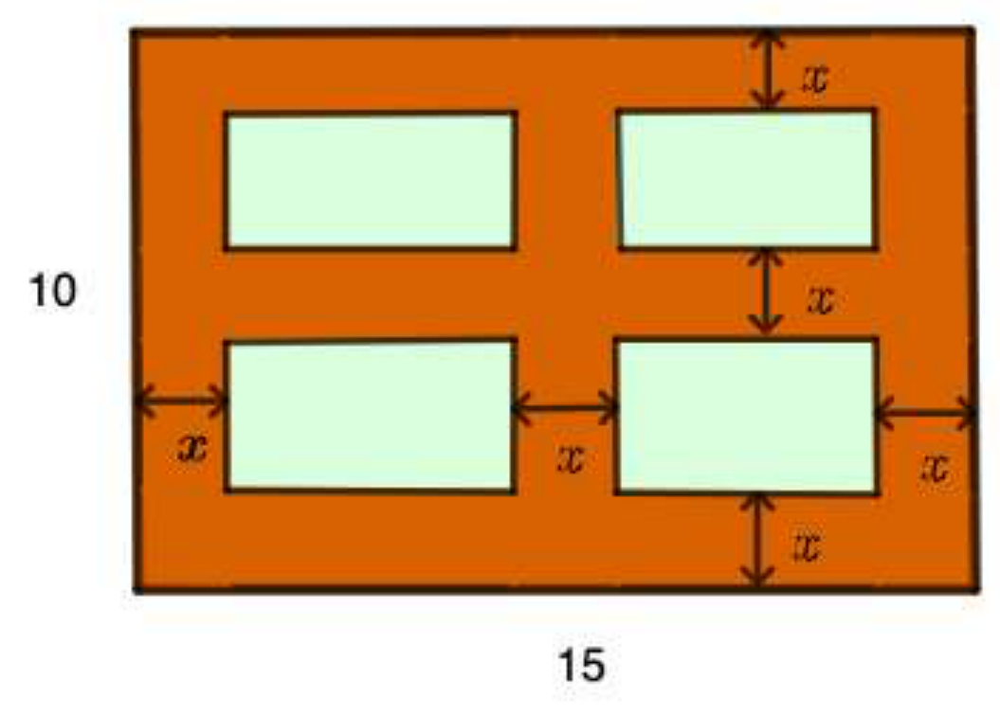

## Enunciado

Un jardín rectangular tiene unas dimensiones de 10 por 15 metros. Se trazan tres caminos de igual anchura: uno rodea al jardín por el interior del rectángulo, mientras que los otros dos dividen el jardín en cuatro partes cultivables de la misma área.

¿Cuál debe ser el ancho de los caminos si se quiere tener una superficie cultivable de 84 m²?

**Razona tu respuesta.**

## Solución

Llamamos $x$ al ancho de los caminos, en metros, y tomamos la base del jardín de 15 m y la altura de 10 m:

El jardín completo mide $15 \cdot 10 = 150\ \text{m}^2$. A esta área le restamos la de los caminos, que se puede dividir en:

- tres rectángulos horizontales de $15 \times x$, con área $15x$ cada uno;
- tres rectángulos verticales de $x \times (10 - 3x)$ (juntando los trozos de cada vertical entre los horizontales), con área $x\,(10 - 3x)$ cada uno.

Como la superficie cultivable debe ser de 84 m²:

$$150 - 3 \cdot 15x - 3x\,(10 - 3x) = 84 \;\Rightarrow\; 9x^2 - 75x + 66 = 0 \;\Rightarrow\; 3x^2 - 25x + 22 = 0.$$

$$x = \frac{25 \pm \sqrt{25^2 - 4 \cdot 3 \cdot 22}}{6} = \frac{25 \pm \sqrt{361}}{6} = \frac{25 \pm 19}{6}.$$

- $x_1 = \frac{44}{6} = \frac{22}{3} \approx 7{,}33$: no tiene sentido con las dimensiones del jardín.
- $x_2 = \frac{6}{6} = 1$: sí tiene sentido.

El ancho de los caminos debe ser de **1 metro**.
