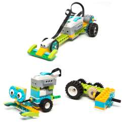

## Enunciado

El instituto donde estudia Julia organizó el curso pasado un concurso de robótica dirigido a los alumnos de 2.º de ESO. En él podían participar equipos formados por 2 alumnos de cualquier instituto de su localidad, que deberían realizar un prototipo. Cada centro podía inscribir a 4 equipos.

A la hora de la competición, había una primera fase en la que cada equipo debía competir una sola vez contra todos los demás equipos, excepto con los de su centro. En la primera edición se inscribieron 8 centros. ¿En cuántos enfrentamientos tiene que participar cada equipo en esta primera fase? ¿Cuántos enfrentamientos se realizaron en total en esta primera fase?

Para la segunda fase se clasifican los equipos que hayan ganado al menos las tres cuartas partes de las partidas en las que han participado. ¿Cuántas partidas debe ganar un equipo como mínimo para pasar de fase?

Tras el éxito del concurso, este año han recibido la petición de 20 centros. ¿Cuántos enfrentamientos se producirán en la primera fase? ¿Cuántos enfrentamientos debería superar un equipo para pasar de fase?

**Razona todas tus respuestas.**

## Solución

**Primer año (8 centros).** Hay $8 \cdot 4 = 32$ equipos. Podemos representar cada equipo con un punto en una circunferencia (los de un mismo centro, del mismo color) y cada enfrentamiento con un segmento que une puntos de distinto color.

Cada equipo se enfrenta a todos los equipos de los otros 7 centros:

$$7\ \text{centros} \cdot 4\ \text{equipos/centro} = \mathbf{28}\ \text{enfrentamientos por equipo}.$$

Cada enfrentamiento lo cuentan los dos equipos, así que en total hay

$$\frac{32 \cdot 28}{2} = \mathbf{448}\ \text{enfrentamientos}.$$

Para pasar a la segunda fase hay que ganar $\frac{3}{4}$ de 28, es decir, **21 partidas** como mínimo.

**Este año (20 centros).** Hay 80 equipos y cada uno juega $19 \cdot 4 = 76$ partidas:

$$\frac{80 \cdot 76}{2} = \mathbf{3040}\ \text{enfrentamientos},$$

y para pasar de fase hay que ganar $\frac{3}{4}$ de 76 = **57 partidas**.

**Generalización.** Con $n$ centros de 4 equipos hay $\frac{4n \cdot 4(n-1)}{2} = 8n\,(n - 1)$ enfrentamientos, y para pasar de fase hay que ganar $3\,(n - 1)$ partidas.
