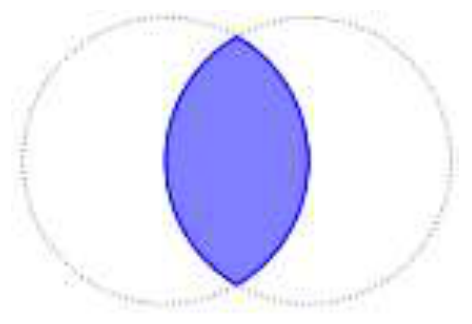

## Enunciado

Los hermanos Isabel y Miguel Visitalotodo están de viaje de estudios recorriendo la ruta del arte románico en Todolandia. Les ha llamado mucho la atención que en todas las iglesias, ermitas y capillas se encuentra una especie de óvalo con la imagen de Dios Padre, que recibe el nombre de Pantocrátor.

Su profesor de matemáticas les ha informado de que ese óvalo recibe el nombre de *vesica piscis* o *mandorla* (en italiano, «almendra») y que se origina con la intersección de dos circunferencias con el mismo radio y tales que el centro de cada una de ellas pertenece a la otra (como puedes observar en la imagen).

Como actividad, les ha pedido que calculen el perímetro y la superficie comprendida dentro de la *vesica piscis* si el radio de las circunferencias es de 60 cm.

Ayuda a Isabel y Miguel resolviendo **de forma razonada** la actividad que les han encomendado.

## Solución

Los centros de las circunferencias y los dos puntos de corte forman dos triángulos equiláteros, así que cada arco del contorno abarca 120°.

**Perímetro.** Son dos arcos de 120°, es decir, $\frac{2}{3}$ de una circunferencia:

$$p = \frac{2}{3} \cdot 2\pi r = \frac{2 \cdot 2\pi \cdot 60}{3} = 80\pi \approx \mathbf{251{,}33\ cm}.$$

**Área.** Son dos segmentos circulares de 120°. Cada segmento es un sector circular menos un triángulo isósceles:

- Sector: $\dfrac{\pi \cdot 60^2 \cdot 120}{360} = 1200\pi \approx 3769{,}91\ \text{cm}^2$.
- Triángulo: su altura es $h = \frac{r}{2} = 30$ cm y su base $b = 2\sqrt{60^2 - 30^2} = 60\sqrt{3}$ cm, así que su área es $\dfrac{60\sqrt{3} \cdot 30}{2} = 900\sqrt{3} \approx 1558{,}85\ \text{cm}^2$.
- Segmento: $1200\pi - 900\sqrt{3} \approx 2211{,}07\ \text{cm}^2$.

$$A = 2\,(1200\pi - 900\sqrt{3}) \approx \mathbf{4422{,}13\ cm^2}.$$
