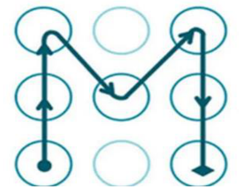
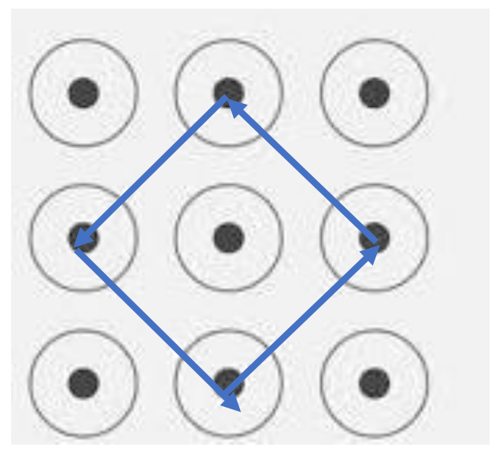
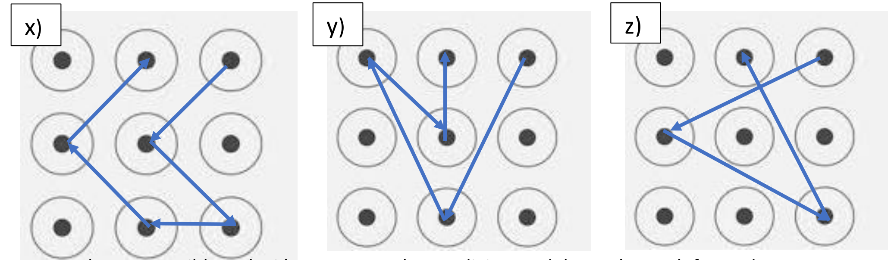

## Enunciado

Al encender el móvil me pidió desbloquearlo dibujando un patrón en la cuadrícula de 3 × 3 puntos.

a) Se me había olvidado, aunque recordaba que había dibujado un cuadrado que no era el más grande ni el más pequeño. ¿Podrías ayudarme a encontrar mi patrón para desbloquear el teléfono?

b) La línea poligonal de la imagen tiene una longitud de más de 6 y menos de 7 unidades (siendo la unidad la medida del segmento que une horizontal o verticalmente dos puntos).

Como ya conoces mi contraseña, la voy a cambiar. Estas son las condiciones que debe cumplir:

1. Que sea una línea poligonal no cerrada.
2. Que su longitud sea mayor que 6 y menor que 7 unidades.
3. Que sea, de todas las posibilidades, la que menos segmentos tenga.
4. Quiero empezar siempre en el vértice superior derecho y acabar en el punto que hay a su izquierda.

Dibuja mi antiguo y mi nuevo patrón.

## Solución

a) El cuadrado que no es ni el más grande (el borde de la cuadrícula) ni el más pequeño (de lado 1) es el cuadrado inclinado que une los puntos medios de los lados:

b) Entre dos puntos de la cuadrícula, un segmento horizontal o vertical entre puntos vecinos mide 1; en diagonal, puede medir $\sqrt{2}$ o $\sqrt{5}$ (por Pitágoras). Para que la longitud esté entre 6 y 7 hay que combinar segmentos de distintos tipos. Algunas posibilidades:

- x) Cuatro diagonales $\sqrt{2}$ y un segmento horizontal: $1 + 4\sqrt{2} \approx 6{,}66$.
- y) Dos diagonales $\sqrt{5}$, una $\sqrt{2}$ y un segmento vertical: $1 + 2\sqrt{5} + \sqrt{2} \approx 6{,}89$.
- z) Tres diagonales $\sqrt{5}$: $3\sqrt{5} \approx 6{,}71$.

La z) es la que tiene menos segmentos, así que es el **nuevo patrón**.
