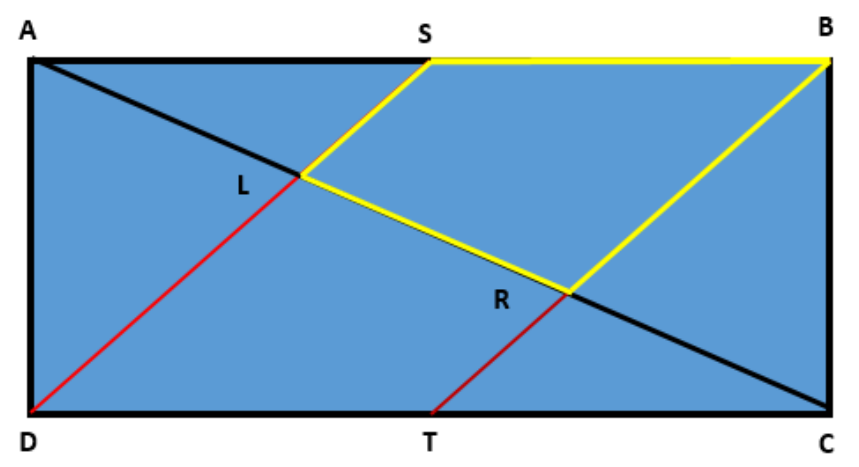

## Enunciado

¡Antonio es un padre de familia un tanto caprichoso, pero muy ocurrente! Quiere hacer en el jardín rectangular de su casa una piscina con la forma del cuadrilátero marcado en amarillo en la figura.

Dispone de la siguiente información, que diseña previamente en su despacho: toma el rectángulo ABCD de la figura. Los puntos S y T son los puntos medios de AB y de DC, respectivamente, y L y R son las intersecciones de AC con SD y con BT, respectivamente.

Suponiendo que AB mide 11 cm y AD mide 4 cm, ¿cuántos centímetros cuadrados de superficie tiene el cuadrilátero SLRB?

**Razona tu respuesta.**

## Solución

El rectángulo mide $11 \cdot 4 = 44\ \text{cm}^2$. Los triángulos DAS y TBC son rectángulos de catetos 4 cm y 5,5 cm, con área $\frac{4 \cdot 5{,}5}{2} = 11\ \text{cm}^2$ cada uno.

El resto, el paralelogramo DSBT, mide $44 - 2 \cdot 11 = 22\ \text{cm}^2$ (también: base 5,5 cm por altura 4 cm). La diagonal AC lo divide en dos cuadriláteros iguales, SLRB y TRLD (simétricos respecto del centro del rectángulo), así que

$$\text{Área}(SLRB) = 22 : 2 = \mathbf{11\ cm^2}.$$
