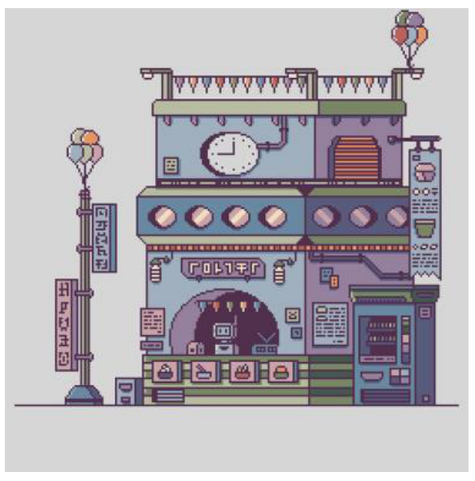
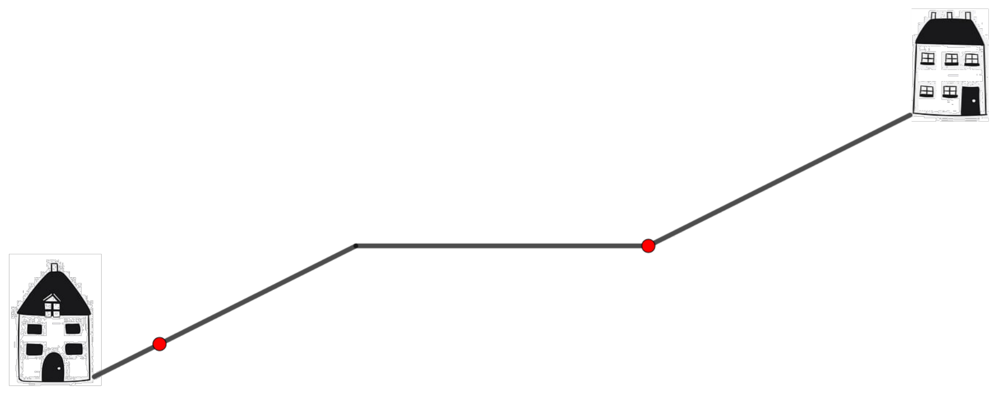
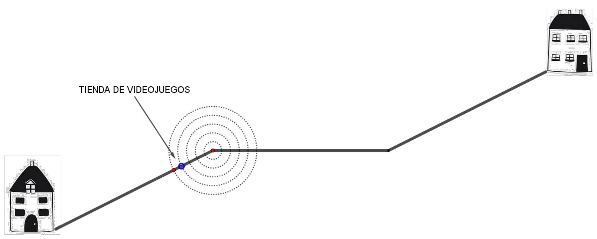

## Enunciado

Lucas y Lucía son dos buenos amigos y todas las tardes salen a la misma hora de sus casas para encontrarse en la tienda de videojuegos, situada entre sus casas, y llegan a la vez.

Andan a la misma velocidad cuando están en llano; cuando están bajando lo hacen dos veces más rápido que en llano, y cuando están subiendo, a la mitad de la velocidad que en la zona llana. Sitúa la tienda de videojuegos en el siguiente esquema, teniendo en cuenta que los tres tramos miden 200 metros, tanto los inclinados como el llano.

¿Podrías situar la tienda de forma exacta y razonar por qué debe estar ahí? ¿A qué distancia está la tienda de cada una de sus casas?

## Solución

Lucas sube (cuesta, llano, cuesta) y Lucía baja. Mientras uno baja y el otro sube, Lucía avanza 4 veces más deprisa que Lucas (ella va al doble de la velocidad en llano y él a la mitad).

- Cuando Lucía ha bajado su cuesta (200 m), Lucas ha subido 50 m, un cuarto de la suya.
- Mientras Lucía recorre el llano (200 m), Lucas sube a la mitad de esa velocidad, 100 m más: está a 150 m, tres cuartos de su cuesta.
- Quedan 50 m entre ellos, en la cuesta de Lucas. Lucía baja 4 veces más deprisa de lo que él sube, así que Lucas recorre $\frac{1}{5}$ de esos 50 m (10 m) y Lucía $\frac{4}{5}$ (40 m).

La tienda está a $\frac{3}{4} \cdot 200 + \frac{1}{5} \cdot 50 =$ **160 m de la casa de Lucas** y a $600 - 160 =$ **440 m de la de Lucía**.
