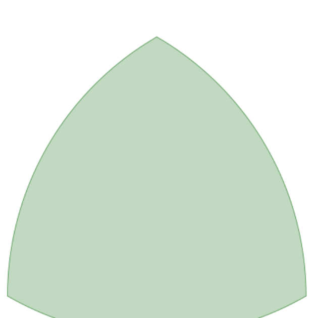

## Enunciado

A Teresa Asombrasedetodo le han mostrado la figura que aparece a continuación, el triángulo de Reuleaux, que era desconocida para ella hasta ese momento. Tras hacer todo tipo de averiguaciones, ha conseguido informarse de que se construye a partir de un triángulo equilátero, trazando tres arcos de radio igual a la longitud del lado del triángulo y con centro en cada uno de sus vértices.

Ahora quiere saber cuál es el perímetro y qué superficie ocupa el que ha construido ella a partir de un triángulo cuyos lados miden 30 cm.

Ayuda a Teresa haciendo de forma razonada todos los cálculos para averiguar el perímetro y el área del triángulo de Reuleaux resultante.

## Solución

Cada arco tiene una amplitud de 60° y un radio de 30 cm, así que los tres arcos juntos forman media circunferencia:

$$p = \frac{2\pi \cdot 30}{2} = 30\pi \approx \mathbf{94{,}25\ cm}.$$

El área es la del triángulo equilátero más la de los tres segmentos circulares que hay sobre sus lados.

- Altura del triángulo: $h = \sqrt{30^2 - 15^2} = 15\sqrt{3}$ cm; área: $\frac{30 \cdot 15\sqrt{3}}{2} = 225\sqrt{3} \approx 389{,}71\ \text{cm}^2$.
- Sector de 60°: $\frac{\pi \cdot 30^2 \cdot 60}{360} = 150\pi \approx 471{,}24\ \text{cm}^2$.
- Segmento circular: $150\pi - 225\sqrt{3} \approx 81{,}53\ \text{cm}^2$.

$$A = 225\sqrt{3} + 3\,(150\pi - 225\sqrt{3}) = 450\pi - 450\sqrt{3} = 450\,(\pi - \sqrt{3}) \approx \mathbf{634{,}29\ cm^2}.$$
