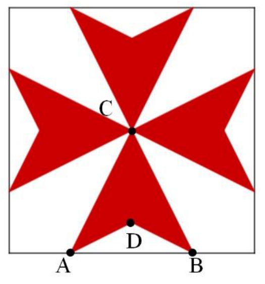
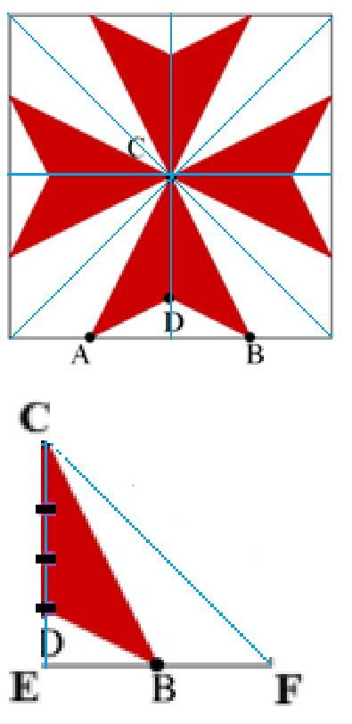

## Enunciado

La cruz de Malta es un símbolo usado desde el siglo XII como insignia por los caballeros hospitalarios de la Orden de San Juan de Jerusalén.

Se construye a partir de un cuadrado cualquiera. El punto C es el centro del cuadrado. La distancia AB es la mitad de la longitud del lado del cuadrado, y la distancia entre el punto D y el lado AB es la cuarta parte de la distancia entre el punto C y ese mismo lado.

¿Qué fracción del cuadrado representa la cruz de Malta?

**Razona tu respuesta.**

## Solución

Trazamos las dos diagonales y las dos medianas del cuadrado, que lo dividen en 8 triángulos rectángulos isósceles iguales. La cruz ocupa la misma fracción de cada uno de ellos, por ejemplo del triángulo EFC (con E el punto medio del lado):

La recta CB divide el triángulo EFC en dos de igual área. Como $CD = 3\,DE$, el triángulo CDB es $\frac{3}{4}$ del triángulo CBE:

$$CDB = \frac{3}{4}\,CBE = \frac{3}{4} \cdot \frac{1}{2}\,EFC = \frac{3}{8}\,EFC.$$

La cruz ocupa **las tres octavas partes del cuadrado**.

**Otra forma.** Si el lado del cuadrado mide 1, entonces $AB = CE = \frac{1}{2}$ y $ED = \frac{1}{8}$. Cada brazo de la cruz es el triángulo CAB menos el triángulo DAB:

$$\frac{\frac{1}{2} \cdot \frac{1}{2}}{2} - \frac{\frac{1}{2} \cdot \frac{1}{8}}{2} = \frac{1}{8} - \frac{1}{32} = \frac{3}{32},$$

y la cruz completa mide $4 \cdot \frac{3}{32} = \frac{3}{8}$ del cuadrado.
