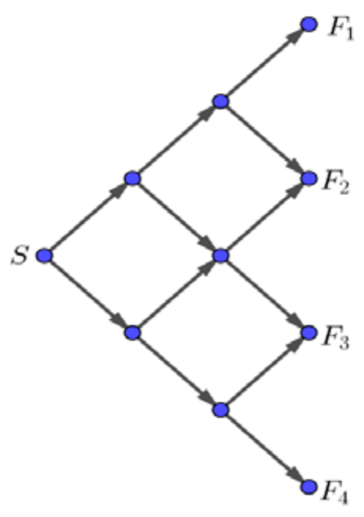

## Enunciado

María y Carmen juegan en el siguiente tablero, compuesto por una casilla de salida S y cuatro casillas de llegada $F_1$, $F_2$, $F_3$ y $F_4$.

Por turnos se lanza un dado de seis caras y se anota la puntuación de la primera tirada de cada jugadora. Después, en cada tirada, si sale par se mueve la ficha hacia arriba y si sale impar, hacia abajo, y siempre hacia la derecha. Cada movimiento hacia arriba multiplica la puntuación por 2 y cada movimiento hacia abajo, por 3.

Por ejemplo, si a una jugadora le sale un 5 en la casilla de salida y, después de tres tiradas, acaba en la casilla $F_2$, obtendría la puntuación $5 \cdot 2 \cdot 2 \cdot 3 = 60$.

Gana la partida la jugadora que obtenga mayor puntuación.

**Contesta de forma razonada** a las siguientes preguntas:

a) Si María termina en $F_4$ y su resultado final es 81, ¿qué número le salió en la casilla S?

b) En esta misma partida, Carmen termina en $F_3$ y le gana el juego a María. ¿Qué números podrían haberle salido en la casilla S?

c) En una nueva partida, María termina en $F_2$ y Carmen en $F_3$. Calcula la probabilidad que tiene cada una de ellas de ganar. ¿Pueden empatar?

d) Si ampliamos el tablero para que haya 6 casillas de llegada, con las mismas reglas de juego, justifica si se pueden obtener las puntuaciones 540, 216 y 240. En caso afirmativo, ¿en qué casilla se termina?

e) En el mismo tablero de 6 casillas de llegada hemos cambiado una de las reglas del juego. Sabemos que una jugadora ha obtenido una puntuación igual a 200. ¿Qué regla se ha cambiado? ¿Qué número le salió en la casilla S?

## Solución

a) Para terminar en $F_4$ hay que sacar tres impares: el número inicial $x$ se multiplica por $3^3 = 27$. Como $27x = 81$, le salió un **3**.

b) Para terminar en $F_3$ hay que sacar un par y dos impares: $x \cdot 2 \cdot 3^2 = 18x$. Para ganar, $18x > 81$, es decir, $x > 4{,}5$: le salió un **5 o un 6**.

c) María, en $F_2$ (dos pares y un impar), obtiene $12x$; Carmen, en $F_3$, obtiene $18y$, con $x$ e $y$ entre 1 y 6:

| | 1 | 2 | 3 | 4 | 5 | 6 |
|---|---|---|---|---|---|---|
| María | 12 | 24 | 36 | 48 | 60 | 72 |
| Carmen | 18 | 36 | 54 | 72 | 90 | 108 |

De las 36 partidas posibles (cada una con la misma probabilidad), María gana en 10, Carmen en 24 y empatan en 2 (con 36 o 72 puntos):

$$P(\text{gana María}) = \frac{10}{36} = \frac{5}{18}, \qquad P(\text{gana Carmen}) = \frac{24}{36} = \frac{2}{3}, \qquad P(\text{empate}) = \frac{2}{36} = \frac{1}{18}.$$

d) Con 6 casillas de llegada hay 5 tiradas, así que la puntuación es el número inicial por cinco factores 2 o 3. Factorizamos:

- $540 = 5 \cdot 2^2 \cdot 3^3$: **sí**; sale un 5 en S, dos pares y tres impares; se termina en $F_4$.
- $216 = 2^3 \cdot 3^3$: **sí**, de dos formas: sale un 3 en S, con tres pares y dos impares (se termina en $F_3$), o sale un 2 en S, con dos pares y tres impares (se termina en $F_4$).
- $240 = 5 \cdot 2^4 \cdot 3$: **sí**; sale un 5 en S, cuatro pares y un impar; se termina en $F_2$.

e) $200 = 2^3 \cdot 5^2 = 1 \cdot 2 \cdot 2 \cdot 2 \cdot 5 \cdot 5$. El 3 no aparece y el 5 sí: la regla cambiada es que **cada movimiento hacia abajo multiplica por 5** en lugar de por 3, y en la casilla S salió un **1**.
