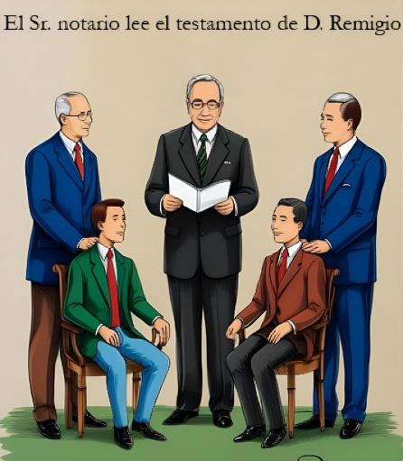

## Enunciado

Tras el fallecimiento de D. Remigio Fraccionalotodo, el señor notario de Todolandia lee ante sus dos hijos lo que el difunto ha dejado dispuesto en su testamento:

- «A cada uno de mis hijos le dejo la tercera parte de mis posesiones, que le corresponde como legítima».
- «Además, a mi hijo mayor le dejo una cuarta parte del resto de mis posesiones, y a mi hijo menor le dejo igualmente la quinta parte de ese resto».
- «Y todos los demás terrenos los cedo al Ayuntamiento de Todolandia para que construya en ellos instalaciones deportivas y zonas verdes».

Las posesiones de D. Remigio Fraccionalotodo eran, en el momento de su fallecimiento, un terreno cuadrado de $\frac{3}{4}$ de kilómetro de lado y 9 parcelas rectangulares de medio kilómetro de largo y 400 m de ancho.

¿Cuántos km² le corresponden a cada uno de sus hijos y cuántos serán cedidos al Ayuntamiento para la construcción de jardines e instalaciones deportivas?

Contesta de forma razonada, dando todas las respuestas y haciendo todos los cálculos en forma de fracciones irreducibles, como era el deseo de D. Remigio Fraccionalotodo.

## Solución

Como $400\ \text{m} = \frac{2}{5}$ km, las posesiones son

$$\left(\frac{3}{4}\right)^2 + 9 \cdot \frac{1}{2} \cdot \frac{2}{5} = \frac{9}{16} + \frac{9}{5} = \frac{189}{80}\ \text{km}^2.$$

Tras la legítima ($\frac{1}{3}$ para cada hijo) queda $\frac{1}{3}$ del total.

- **Hijo mayor:** $\left(\frac{1}{3} + \frac{1}{4} \cdot \frac{1}{3}\right) \cdot \frac{189}{80} = \frac{5}{12} \cdot \frac{189}{80} =$ **$\frac{63}{64}$ km²**.
- **Hijo menor:** $\left(\frac{1}{3} + \frac{1}{5} \cdot \frac{1}{3}\right) \cdot \frac{189}{80} = \frac{2}{5} \cdot \frac{189}{80} =$ **$\frac{189}{200}$ km²**.
- **Ayuntamiento:** $\frac{189}{80} - \frac{63}{64} - \frac{189}{200} =$ **$\frac{693}{1600}$ km²**.
