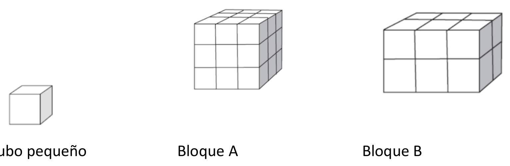

## Enunciado

A Ados le gusta construir bloques con cubos pequeños como los que se muestran a continuación:

**Contesta razonadamente** a las siguientes cuestiones:

1. ¿Cuántos cubos pequeños necesitará Ados para hacer el bloque A, sabiendo que es macizo? ¿Y para el bloque B?
2. Ados se da cuenta de que ha utilizado más cubos pequeños de los que realmente necesitaba para hacer un bloque como el bloque A: podía haberlo construido pegando los cubos pequeños, pero dejándolo hueco por dentro. ¿Cuál es el mínimo número de cubos que necesita para hacer un bloque como el bloque A, pero hueco?
3. Ahora Ados quiere construir un bloque que parezca macizo y que tenga 6 cubos pequeños de largo, 5 de ancho y 4 de alto. Quiere usar el menor número posible de cubos, dejando el mayor hueco posible en el interior. ¿Cuál es el mínimo número de cubos que necesitará?
4. ¿Cuántos cubos en total tendrá un bloque macizo regular (un cubo) cuyo alto es de 11 cubos pequeños?
5. ¿Cuántos cubos tendrá de ancho un bloque regular construido con 12 167 cubos pequeños?

## Solución

1. El bloque A tiene 3 capas de 9 cubos: **27 cubos**. El bloque B tiene 2 capas de 6 cubos: **12 cubos**.
2. Hueco por dentro solo le falta el cubo central: $3^3 - 1^3 =$ **26 cubos** (también se puede contar: $9 + 9 + 3 + 3 + 1 + 1 = 26$).
3. Macizo tendría $6 \cdot 5 \cdot 4 = 120$ cubos, y el hueco interior más grande mide $(6 - 2)(5 - 2)(4 - 2) = 24$ cubos. Hacen falta **96 cubos**.
4. Un bloque regular tiene las tres dimensiones iguales: $11^3 =$ **1331 cubos**.
5. $\sqrt[3]{12\,167} =$ **23 cubos** de ancho.
