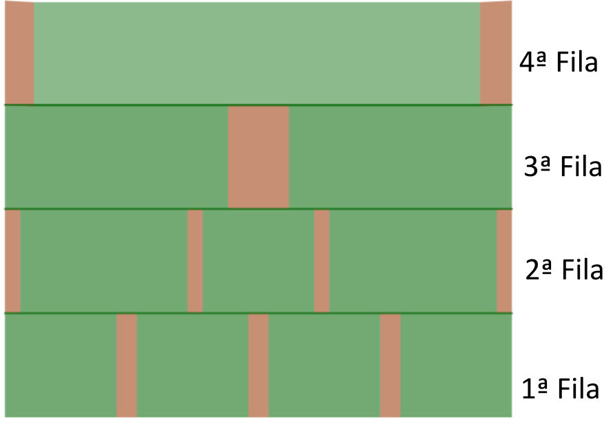

## Enunciado

En la imagen se muestra el diseño del próximo jardín vertical que voy a construir, que tiene las siguientes características:

- Las partes verdes son las jardineras donde van las plantas, y las partes de color marrón son los separadores entre las jardineras.
- Las medidas en centímetros de todas las jardineras y los separadores son números enteros.
- Todas las filas miden 2 m de largo.
- La medida total de las jardineras de cada fila es la misma. Lo mismo ocurre con los separadores.
- En la fila que tiene 3 jardineras, la jardinera del centro mide igual que las de la primera fila.

**Contesta de forma razonada:**

a) ¿Qué relación existe entre la medida de la jardinera de la cuarta fila y la de las de la primera fila?

b) ¿Qué relación existe entre la medida de las dos jardineras de la tercera fila y las de la primera?

c) ¿Qué relación existe entre la medida de las jardineras de mayor tamaño de la segunda fila y las de la primera?

d) Calcula la medida de las jardineras y los separadores de cada una de las filas, teniendo en cuenta que el tamaño de las jardineras debe ser lo más grande posible.

## Solución

Llamamos $x$ a la jardinera de la primera fila. Como el total de jardineras es el mismo en cada fila ($4x$):

a) La jardinera de la cuarta fila mide $4x$: **el cuádruplo**.

b) Las de la tercera fila miden $2x$: **el doble**.

c) En la segunda fila, la central mide $x$ y las laterales $z$, con $2z + x = 4x$, así que $z = \frac{3}{2}x$: **una vez y media**.

d) Llamamos $a$, $b$, $c$ y $d$ a los separadores de las filas 1.ª a 4.ª. El total de separadores es el mismo en todas las filas:

$$3a = 4b = c = 2d.$$

Además, en la segunda fila, $4x + 4b = 200$, de donde $x + b = 50$.

Para que $a = \frac{4}{3}b$ sea entero, $b$ tiene que ser múltiplo de 3, y para que $z = \frac{3}{2}x$ sea entero, $x$ tiene que ser par (y por tanto $b$ también). Así que $b$ es múltiplo de 6:

| $b$ | $a$ | $c$ | $d$ | $x$ | $z$ |
|---|---|---|---|---|---|
| 6 | 8 | 24 | 12 | 44 | 66 |
| 12 | 16 | 48 | 24 | 38 | 57 |
| 18 | 24 | 72 | 36 | 32 | 48 |
| 24 | 32 | 96 | 48 | 26 | 39 |

Las jardineras son lo más grandes posible con $b = 6$:

- **1.ª fila:** jardineras de 44 cm y separadores de 8 cm.
- **2.ª fila:** jardinera central de 44 cm, laterales de 66 cm y separadores de 6 cm.
- **3.ª fila:** jardineras de 88 cm y separador de 24 cm.
- **4.ª fila:** jardinera de 176 cm y separadores de 12 cm.
