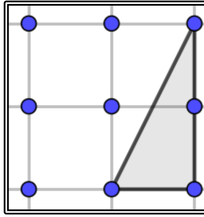
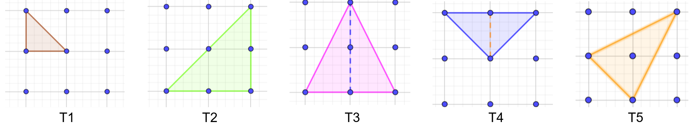

## Enunciado

En la trama de 3 × 3 puntos se pueden trazar triángulos con vértices en los puntos de la trama, como el del ejemplo. Este es un triángulo no isósceles de superficie 1 y perímetro $3 + \sqrt{5}$.

a) Traza en la trama 3 × 3 todos los tipos de triángulos isósceles diferentes que se puedan dibujar y **calcula razonadamente** la superficie y el perímetro de todos ellos.

b) Establecemos el siguiente criterio de ordenación de dichos triángulos: un triángulo T es *mejor* que otro triángulo P si la superficie de T es mayor que la de P y el perímetro de T es mayor que el de P.

Con este criterio, **contesta razonadamente**: ¿cuál es el mejor triángulo de todos los del apartado anterior? ¿Y cuál sería el peor de ellos?

## Solución

a) Hay cinco tipos de triángulos isósceles:

| | Lados | Superficie | Perímetro |
|---|---|---|---|
| T1 | $1,\ 1,\ \sqrt{2}$ | $\frac{1}{2}$ | $2 + \sqrt{2} \approx 3{,}41$ |
| T2 | $2,\ 2,\ 2\sqrt{2}$ | $2$ | $4 + 2\sqrt{2} \approx 6{,}83$ |
| T3 | $2,\ \sqrt{5},\ \sqrt{5}$ | $2$ | $2 + 2\sqrt{5} \approx 6{,}47$ |
| T4 | $2,\ \sqrt{2},\ \sqrt{2}$ | $1$ | $2 + 2\sqrt{2} \approx 4{,}83$ |
| T5 | $\sqrt{2},\ \sqrt{5},\ \sqrt{5}$ | $\frac{3}{2}$ | $\sqrt{2} + 2\sqrt{5} \approx 5{,}89$ |

Las longitudes salen del teorema de Pitágoras ($1^2 + 1^2 = 2$, $1^2 + 2^2 = 5$, $2^2 + 2^2 = 8$). Las áreas de T1 a T4 son base por altura entre 2. En T5, la altura sobre el lado $\sqrt{2}$ cumple $h^2 + \left(\frac{\sqrt{2}}{2}\right)^2 = 5$, así que $h = \frac{3\sqrt{2}}{2}$ y el área es $\frac{\sqrt{2} \cdot \frac{3\sqrt{2}}{2}}{2} = \frac{3}{2}$.

b) **No hay un mejor triángulo**: los de mayor superficie, T2 y T3, tienen la misma, así que ninguno es mejor que el otro, y ningún triángulo supera a todos los demás en las dos cosas. En cambio, todos tienen más superficie y más perímetro que T1, así que **T1 es el peor**.
