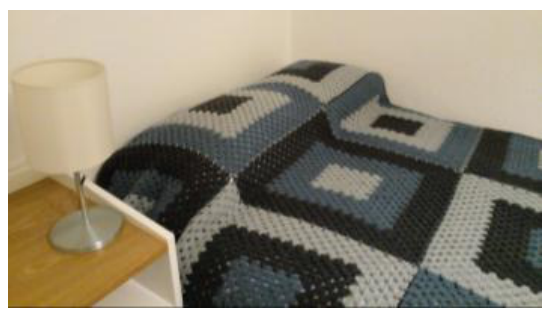

## Enunciado

A mi tía Ada le encanta hacer ganchillo y hace unas colchas muy bonitas. Quiero que me haga una parecida a la suya (la que se ve en la fotografía) para estrenarla el día 16 de mayo del próximo año, pero tengo que pedírsela con el tiempo de antelación necesario.

La colcha debe cubrir mi cama, que mide 105 × 190 cm, y estará formada por cuadrados confeccionados con lana de mis 5 colores favoritos. Las condiciones para tejer los cuadrados son:

- Cada cuadrado debe tener 4 colores diferentes, y en cada cuadrado estarán en distinto orden.
- La colcha debe confeccionarse con todos los cuadrados distintos que se puedan formar con los 5 colores.
- Cada color forma una banda de 2 cm de ancho (como se puede apreciar en la imagen).
- Cada lado de la colcha debe tener un número par de cuadrados.

Ayuda a Ada en la confección de la colcha contestando **razonadamente** las siguientes cuestiones:

- ¿Cuántos cuadrados distintos se pueden confeccionar con mis 5 colores favoritos?
- ¿Qué dimensiones va a tener la colcha una vez terminada?
- Si Ada teje un cuadrado cada 3 días, ¿cuándo tendrá que empezar a confeccionar la colcha para que esté terminada el día 16 de mayo de 2026?

## Solución

- Cada cuadrado lleva 4 de los 5 colores, en orden, desde la banda exterior a la central: $5 \cdot 4 \cdot 3 \cdot 2 =$ **120 cuadrados distintos**.
- Cada cuadrado tiene 4 bandas de 2 cm a cada lado del centro, así que mide $2 \cdot 2 \cdot 4 = 16$ cm de lado. Para cubrir los 105 cm de ancho hacen falta al menos 7 cuadrados ($105 : 16 \approx 6{,}6$). Con 120 cuadrados, las opciones son 8 × 15 o 10 × 12, y como los dos lados deben ser pares, la colcha tiene 10 × 12 cuadrados. Comprobamos que cubre el largo: $12 \cdot 16 = 192$ cm. La colcha mide **160 × 192 cm**.
- Los 120 cuadrados llevan $120 \cdot 3 = 360$ días. Contando hacia atrás desde el 16 de mayo de 2026, Ada tiene que empezar **hacia el 21 de mayo de 2025** (la solución oficial dice el 20, que deja un día de margen).
