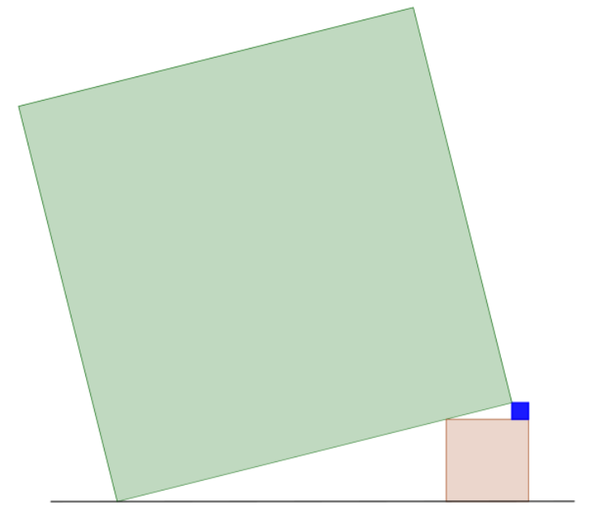
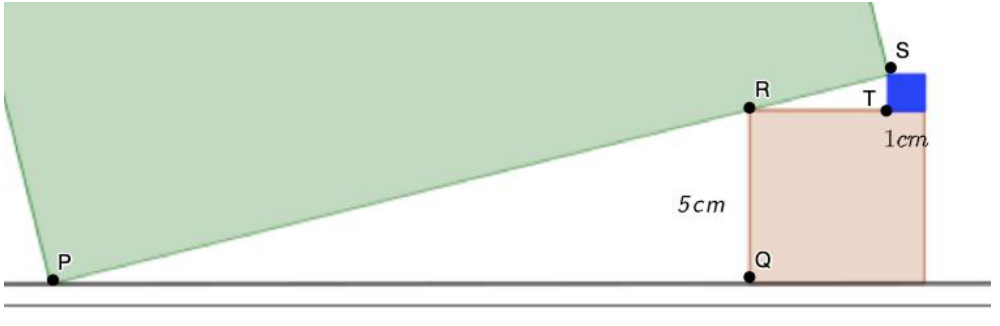

## Enunciado

Rocío le propone a Olivia que resuelva el siguiente ejercicio geométrico de equilibrio de cubos.

Para ello, coloca un cubo pequeño, de 1 cm de lado, sobre un cubo mediano de 5 cm de lado. Finalmente, apoya el cubo grande sobre estos dos, como se muestra en la imagen, de manera que esté en equilibrio.

¿Cuál es la medida del lado del cubo grande?

**Razona la respuesta.**

## Solución

Llamamos P, Q, R, S y T a los puntos de la figura:

$QR = 5$ cm y $ST = 1$ cm; como el cubo pequeño está sobre el mediano, $RT = 5 - 1 = 4$ cm. Por Pitágoras en el triángulo rectángulo SRT:

$$RS = \sqrt{4^2 + 1^2} = \sqrt{17}\ \text{cm}.$$

Los triángulos PQR y RTS son semejantes (sus ángulos son iguales), así que

$$\frac{ST}{RQ} = \frac{RS}{PR} \;\Rightarrow\; \frac{1}{5} = \frac{\sqrt{17}}{PR} \;\Rightarrow\; PR = 5\sqrt{17}\ \text{cm}.$$

El lado del cubo grande mide

$$PS = PR + RS = 5\sqrt{17} + \sqrt{17} = 6\sqrt{17} \approx \mathbf{24{,}74\ cm}.$$
